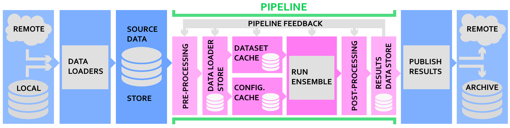

# Technical Overview & Definitions
## Technical Diagram
To aid in the processing of IceNet, **Figure 1** provides a visual overview of how 
data flows from source (data retrieved) through to training and prediction workflows.

/// caption
**Figure 1:** IceNet processing pipeline
///

As a user, the use of this library is in stitching together the workflow for processing
data into a machine learning ready format, running training and predictions, then 
analysing the outputs using IceNet's extensive pre-prepared plotting.

IceNet provides the sea-ice specific tooling to perform this with UNet's and tooling
derived from the [environmental-forecasting](https://github.com/environmental-forecasting)
ecosystem, but does not restrict you to using these tools to build your workflows. 

## What IceNet provides

## How to use this library

### Tooling you *can* use

* icenet-pipeline
* download-toolbox
* preprocess-toolbox
* model-ensembler

### Otherwise

...